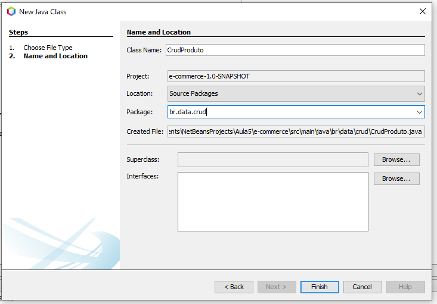
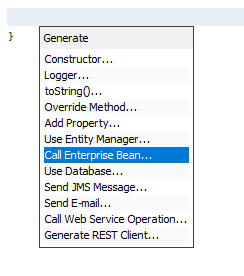

# E-COMMERCE COM EJB


**Neste exemplo, não teremos integração com banco de dados; utilizaremos uma classe como uma lista de produtos.**

> **Itens que devem estar pré-instalados para execução do projeto:**

> - [x] IDEA NETBEANS 12.3 
> - [x] JAVA 11
> - [x] PAYARA SERVER

## Iniciando o projeto

### 1. Criar um novo projeto


- Dê um nome ao projeto e ao pacote.


- Adote o Payara Server na versão Java EE 8 Web.!
[alt text](img/image-2.png)

### 2. Adicionar o Framework JavaServer Faces para ser o cliente do EJB


### 3. Dentro do pacote `br`, crie a classe modelo `Produto`, responsável pela persistência.


- Utilizaremos o Lombok para que a classe fique mais enxuta. **Para utilizar o Lombok, há duas maneiras: através da pesquisa pela própria IDE ou adicionando as dependências manualmente.**

- Clique com o mouse na lâmpada, escolha a opção "Procurar".

  Preencha o campo com a dependência desejada.

- Aguarde alguns instantes para localizar a dependência, clique nela e depois em "Add".

- Depois que concluir a instalação, importe a dependência.


- Código de exemplo:
  
  ```java
  package br.data.model;

  import lombok.Data;

  /**
   * Sandro Amancio de Sá
   */
  @Data
  public class Produto {
      private int codigo;
      private String descricao;
      private double preco;

      public Produto() { }

      public Produto(int codigo, String descricao, double preco) {
          this.codigo = codigo;
          this.descricao = descricao;
          this.preco = preco;
      } 
  }
  ```

### 4. Agora, no pacote `br`, crie uma nova classe que servirá de CRUD para a classe `Produto`. Neste caso, usaremos uma lista de produtos.


- Crie uma lista contendo alguns produtos:

```java
package br.data.crud;

import br.data.model.Produto;
import java.util.ArrayList;

/**
 * Sandro Amancio de Sá
 */
public class CrudProduto {
    public ArrayList<Produto> getAll() {
        ArrayList<Produto> listaDeProdutos = new ArrayList<>();
        listaDeProdutos.add(new Produto(1, "Computador", 2000.00));
        listaDeProdutos.add(new Produto(2, "Notebook", 3000.00));
        listaDeProdutos.add(new Produto(3, "Workstation", 5000.00));
        listaDeProdutos.add(new Produto(4, "Servidor", 8000.00));
        return listaDeProdutos;
    } 
}
```

### 5. Crie um EJB para listar os produtos.

- Como é uma única chamada, utilizaremos o `Stateless`.


- Crie um método para retornar a lista de produtos:

```java
package br.ejb;

import br.data.crud.CrudProduto;
import br.data.model.Produto;
import java.util.ArrayList;
import javax.ejb.Stateless;

/**
 * @author Sandro Amancio de Sá
 */
@Stateless
public class EjbProduto {
    public ArrayList<Produto> getAll() {
        return new CrudProduto().getAll();
    }
}
```

## 6. Conectando a regra de negócios com o cliente JavaServer Faces

- Crie um CDI Bean para conectar o Java com XHTML.


- Com escopo de request, porque com uma requisição a lista é resolvida.


- Invocando o EJB:



```java
package br.jsf;

import br.data.model.Produto;
import br.ejb.EjbProduto;
import java.util.ArrayList;
import javax.ejb.EJB;
import javax.inject.Named;
import javax.enterprise.context.RequestScoped;

/**
 * @author Sandro Amancio de Sá
 */
@Named(value = "jsfProduto")
@RequestScoped
public class JsfProduto {

    @EJB
    private EjbProduto ejbProduto;

    /**
     * Cria uma nova instância de JsfProduto
     */
    public JsfProduto() { }

    public ArrayList<Produto> getAll() {
        return ejbProduto.getAll();
    }
}
```

- **No código acima, há um acoplamento com a classe `Produto`. Para não ter esse acoplamento, você pode implementar uma interface `Produto`.**

### 7. Exibindo lista no JavaServer Faces. Adicione as tags abaixo ao arquivo `index.xhtml`:

```xhtml
<h:form>
    <h:dataTable value="#{jsfProduto.all}" var="prod">
        <h:column>
            <h:outputText value="#{prod.codigo}"/>
        </h:column>
        <h:column>
            <h:outputText value="#{prod.descricao}"/>
        </h:column>
        <h:column>
            <h:outputText value="#{prod.preco}"/>
        </h:column>
    </h:dataTable>
</h:form>
```

### 8. Criando modelo `ItemCompra`


```java
package br.data.model;

import lombok.Data;

/**
 * @author Sandro Amancio de Sá
 */
@Data
public class ItemCompra {

    private Produto produto;
    private int quantidade;

    public ItemCompra() { }

    public ItemCompra(Produto produto, int quantidade) {
        this.produto = produto;
        this.quantidade = quantidade;
    }
}
```

### 9. Criar um EJB mantendo o estado para criar a regra de negócio.


- Código exemplo:

```java
package br.data.crud;

import br.data.model.ItemCompra;
import br.data.model.Produto;
import java.util.ArrayList;
import javax.ejb.Stateful;

/**
 * @author Sandro Amancio de Sá
 */
@Stateful
public class EjbCompra {

    private final ArrayList<ItemCompra> listaDeCompra;

    public EjbCompra() {
        listaDeCompra = new ArrayList<>();
    }

    public void add(Produto produto) {
        boolean achou = false;
        for (ItemCompra itemCompra : listaDeCompra) {
            if (itemCompra.getProduto().getCodigo() == produto.getCodigo()) {
                itemCompra.setQuantidade(itemCompra.getQuantidade() + 1);
                achou = true;
                break;
            }
        }
        if (!achou) {
            listaDeCompra.add(new ItemCompra(produto, 1));
        }
    }

    public void remove(Produto produto) {
        for (ItemCompra itemCompra : listaDeCompra) {
            if (itemCompra.getProduto().getCodigo() == produto.getCodigo()) {
                if (itemCompra.getQuantidade() > 1) {
                    itemCompra.setQuantidade(itemCompra.getQuantidade() - 1);
                } else {
                    listaDeCompra.remove(itemCompra);
                }
                break; 
            }
        }
    }

    public ArrayList<ItemCompra> getAll() {
        return listaDeCompra;
    }
}
```

### 10. Conectando a regra de negócios com o cliente JavaServer Faces.


- Com escopo de session, porque a requisição não pode ser resolvida em uma só chamada. O cliente pode adicionar e remover itens várias vezes.


- Chamando o EJB:


- Código de exemplo:
```java
package br.jsf;

import br.data.crud.EjbCompra;
import br.data.model.ItemCompra;
import br.data.model.Produto;
import javax.inject.Named;
import javax.enterprise.context.SessionScoped;
import java.io.Serializable;
import java.util.ArrayList;
import javax.ejb.EJB;

/**
 * @author Sandro Amancio de Sá
 */
@Named(value = "jsfCompra")
@SessionScoped
public class JsfCompra implements Serializable {

    @EJB
    private EjbCompra ejbCompra;

    /**
     * Cria uma nova instância de JsfCompra
     */
    public JsfCompra() { }

    public void add(Produto produto) {
        ejbCompra.add(produto);
    }

    public ArrayList<ItemCompra> getAll() {
        return ejbCompra.getAll();
    }
}
```

- Adicionando botão para inserir e remover itens na compra e exibir na tela:

```xhtml
<?xml version='1.0' encoding='UTF-8' ?>
<!DOCTYPE html PUBLIC "-//W3C//DTD XHTML 1.0 Transitional//EN" "http://www.w3.org/TR/xhtml1/DTD/xhtml1-transitional.dtd">
<html xmlns

="http://www.w3.org/1999/xhtml"
      xmlns:h="http://xmlns.jcp.org/jsf/html">
    <h:head>
        <title>EJB-COMMERCE</title>
    </h:head>
    <h:body>
        <h:form>
            Lista de Produtos
            <h:dataTable value="#{jsfProduto.all}" var="prod">
                <h:column>
                    <h:outputText value="#{prod.codigo}"/>
                </h:column>
                <h:column>
                    <h:outputText value="#{prod.descricao}"/>
                </h:column>
                <h:column>
                    <h:outputText value="#{prod.preco}"/>
                </h:column>
                <h:column>
                    <h:commandButton value="Add" action="#{jsfCompra.add(prod)}"/>
                </h:column>
            </h:dataTable>
        </h:form>

        <h:form>
            Itens de Compra
            <h:dataTable value="#{jsfCompra.all}" var="item">
                <h:column>
                    <h:outputText value="#{item.produto.codigo}"/>
                </h:column>
                <h:column>
                    <h:outputText value="#{item.produto.descricao}"/>
                </h:column>
                <h:column>
                    <h:outputText value="#{item.produto.preco}"/>
                </h:column>
                <h:column>
                    <h:outputText value="#{item.quantidade}"/>
                </h:column>
            </h:dataTable>
        </h:form>
    </h:body>
</html>
```

